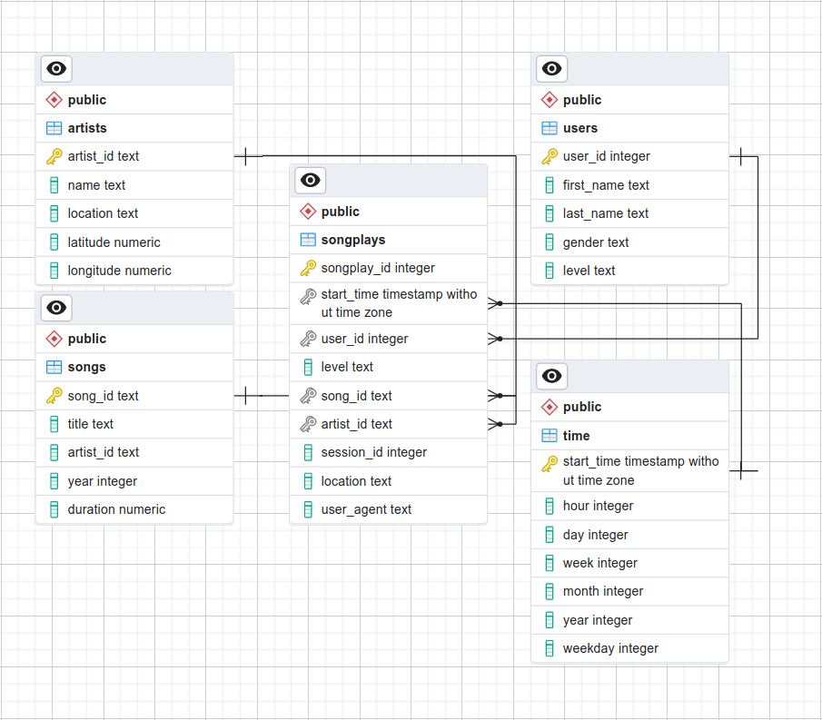

<div id="top"></div>

<!-- TABLE OF CONTENTS -->
<details>
  <summary>Table of Contents</summary>
  <ol>
    <li>
      <a href="#about-the-project">About The Project</a>
      <ul>
        <li><a href="#premise">Premise</a></li>
        <li><a href="#goal">Goal</a></li>
        <li><a href="#data">Data</a></li>
      </ul>
    </li>
    <li>
      <a href="#getting-started">Getting Started</a>
      <ul>
        <li><a href="#conda">Setting up a conda environment</a></li>
        <li><a href="#postgres">Initializing PostgreSQL database</a></li>
      </ul>
    </li>
    <li><a href="#usage">Usage</a></li>
    <li><a href="#notes">Additional Notes</a></li>
    <li><a href="#license">License</a></li>
    <li><a href="#contact">Contact</a></li>
    <li><a href="#acknowledgments">Acknowledgments</a></li>
  </ol>
</details>

**WORK IN PROGRESS**

# Sparkify
A project from the [Data Engineering Nanodegree Program at Udacity](https://learn.udacity.com/nanodegrees/nd027) to practice data modeling in relational databases using PostgreSQL.

## About The Project

### Premise

> A startup called Sparkify wants to analyze the data they've been collecting on songs and user activity on their new music streaming app. The analytics team is particularly interested in understanding what songs users are listening to. Currently, they don't have an easy way to query their data, which resides in a directory of JSON logs on user activity on the app, as well as a directory with JSON metadata on the songs in their app.
>
> They'd like a data engineer to create a Postgres database with tables designed to optimize queries on song play analysis, and bring you on the project. Your role is to create a database schema and ETL pipeline for this analysis. You'll be able to test your database and ETL pipeline by running queries given to you by the analytics team from Sparkify and compare your results with their expected results.

<p align="right">(<a href="#top">back to top</a>)</p>

### Goal

The goal of this project is to apply what I have learned on data modeling with Postgres and build an ETL pipeline using Python. Fact and dimension tables for a star schema will be defined for a particular analytics focus. Additionally, an ETL pipeline will be established to transfer data from .json files in local directories into Postgres tables using Python and SQL.

<p align="right">(<a href="#top">back to top</a>)</p>

### Data

The `data` directory contains two datasets made up of songs and activity logs, respectively.

#### The song dataset

A subset of real data from the [Million Song Dataset](http://millionsongdataset.com/). Each file is in JSON format and contains metadata about a song and the artist of that song. Files are located under `data/song_data`.

For example, this is how the first file (`TRAAAAW128F429D538.json`) looks like:

```json
{
  "num_songs": 1,
  "artist_id": "ARD7TVE1187B99BFB1",
  "artist_latitude": null,
  "artist_longitude": null,
  "artist_location": "California - LA",
  "artist_name": "Casual",
  "song_id": "SOMZWCG12A8C13C480",
  "title": "I Didn't Mean To",
  "duration": 218.93179,
  "year": 0
}

```

<p align="right">(<a href="#top">back to top</a>)</p>

#### Log dataset

It is composed of log files in NDJSON format generated by this [event simulator](https://github.com/Interana/eventsim) based on the songs in the dataset above. These simulate activity logs from a music streaming app based on specified configurations. Files are located under `data/log_data`.

The log files are named following a date pattern (`{year}_{month}_{day}_events.json`), and below is the first line of the first file (`2018-11-01-events`) as an example:

```json
{
  "artist": null,
  "auth": "Logged In",
  "firstName": "Walter",
  "gender": "M",
  "itemInSession": 0,
  "lastName": "Frye",
  "length": null,
  "level": "free",
  "location": "San Francisco-Oakland-Hayward, CA",
  "method": "GET",
  "page": "Home",
  "registration": 1540919166796.0,
  "sessionId": 38,
  "song": null,
  "status": 200,
  "ts": 1541105830796,
  "userAgent": "\"Mozilla/5.0 (Macintosh; Intel Mac OS X 10_9_4) AppleWebKit/537.36 (KHTML, like Gecko) Chrome/36.0.1985.143 Safari/537.36\"",
  "userId": "39"
}

```

### Data Schema

This project uses a star schema that is better understood through an Entity Relationship Diagram (ERD). The following image shows the ERD of the completed project, as obtained with **pgadmin4**.



<p align="right">(<a href="#top">back to top</a>)</p>

## Getting Started

To make use of this project, I recommend managing the required dependencies with Anaconda.

### Setting up a conda environment

Install miniconda:

```bash
wget https://repo.anaconda.com/miniconda/Miniconda3-latest-Linux-x86_64.sh
bash Miniconda3-latest-Linux-x86_64.sh
```

Install mamba:

```bash
conda install -n base -c conda-forge mamba
```

Install environment using provided file:

```bash
mamba create -f environment.yml # alternatively use environment_core.yml
mamba activate sparkify
```

### Initializing PostgreSQL database

Create base database:

```bash
initdb -D base_db
```

Start postgress server:

```bash
pg_ctl -D base_db -l logfile start
```

Create super user:

```bash
createuser -s --encrypted --pwprompt student
```

Create student database:

```bash
createdb --owner=student studentdb
```

## Usage

...


<p align="right">(<a href="#top">back to top</a>)</p>


## Additional Notes

Code formatted using the following commands:

```bash
isort .
autoflake -r --in-place --remove-unused-variable --remove-all-unused-imports --ignore-init-module-imports .
black .
```

## License

Distributed under the MIT License. See `LICENSE` for more information.

<p align="right">(<a href="#top">back to top</a>)</p>

## Contact

[Carlos Uziel Pérez Malla](https://www.carlosuziel-pm.dev/)

[GitHub](https://github.com/CarlosUziel) - [Google Scholar](https://scholar.google.es/citations?user=tEz_OeIAAAAJ&hl=es&oi=ao) - [LinkedIn](https://at.linkedin.com/in/carlos-uziel-p%C3%A9rez-malla-323aa5124) - [Twitter](https://twitter.com/perez_malla)

<p align="right">(<a href="#top">back to top</a>)</p>

## Acknowledgments

This README includes a summary of the official project description provided to the students of the [Data Engineering Nanodegree Program at Udacity](https://learn.udacity.com/nanodegrees/nd027).

Part of the contents and structure of this README was inspired by [kenhanscombe](https://github.com/kenhanscombe/project-postgres).

<p align="right">(<a href="#top">back to top</a>)</p>